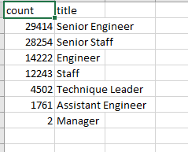
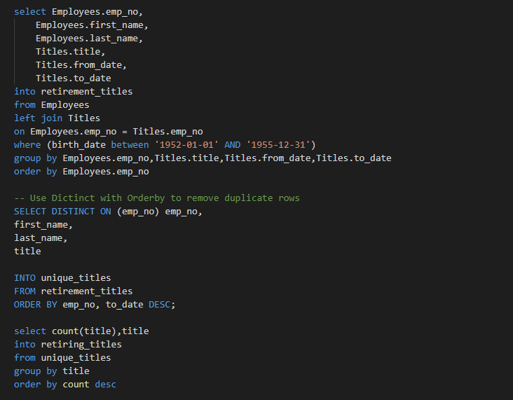
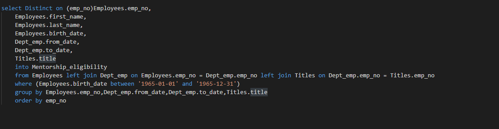

# Pewlett-Hackard-Analysis
# Overview
The purpose of this project was done in order to help a company, Pewlett-Hackard, determine the numer of retiring employees determined by their job title as well as to determine which employees are eligible to participate in a companywide mentorship program. In order to accomplish this multiple tables had to be merged together based upon certain criteria in order to create new, merged databases, that could then be exported to csv files.

# Results

* We can see in the above image the result of the first database merge, intended to find the number of retiring employees based upon their job title. This csv file was created through the following sql query in which employees are filter based upon the critera of their birthday occuring between the years of 1952-01-01' AND '1955-12-31' and then cleaned based upon a unique employee number before being counted based upon title:

* In this image it is apparent that the bulk of the retiring employees consist of senior engineers and senior staff. This makes sense from a logical perspective as senior engineers and senior staff would have logically progressed further in their career, in order to achieve the senior title, and would thus be closer to retirement age. While this makes sense it is potentially a cause for concern for Pewlett-Hackard as if a large bulk of their senior employees leave all at once then it could leave a void in leadership for the company.

* Due to this it the mentorship program that Pewlett-Hackard is implementing is of crucial importance as the retiring employees would be able to mentor younger people and train them up for a potential future leadership position before the retiring employees have left the company.

In order to determine who would be eligible to participate in the mentorship program the following query was written:

* This query is merging three data sets based upon distinct results off the criteria of between '1965-01-01' and '1965-12-31'. For all of these queries it was important to return distinct results so that employees who might have changed titles over the years were not repeating. With this list in hand Pewlett-Hackard can potentially being training its next generation of leaders.

# Results

As we have seen in the images above Pewlett-Hackard will be hit with a large employee attrition (numbering potentially in the tens of thousands) in the near future with the majority of the employees retiring being senior engineers and senior staff. Additionally Pewlett-Hackard will be losing large amounts of employees with the tiles of engineer and staff and lesser amounts of Technique Leaders, Assistance Engineers and finally very few managers. 

Based upon the results of the mentorship eligibility dataframe we can see that while there are large numbers of retirement aged, qualifed people to mentor the next generation of leaders it is relatively not as large as the potential attrition. With this Hewlett-Packard may be forced to do large scale trainings in order to bolster the training for the next generations of leaders or look to hire outside of the company.

Finally, while this data is certainly of use to the management of Pewlett-Hackard it could be bolstered through the use of addtional information including using queries to locate the number of available people in positions more junior than the people who are set to retire to determine which of the positions are going to be relatively hit the most. For example while the senior engineer position is the one that is forecasted to have the most employee attrition, it would be useful to know how many qualified engineers there currently are in the company to take over. In this manner Pewlett-Hackard could better prepare for eventualities. Additionally, Pewlett-Hackard should attempt to quantify the average duration of time employees are in the company in order to prepare for events like this that may potentially occur again in the future.
