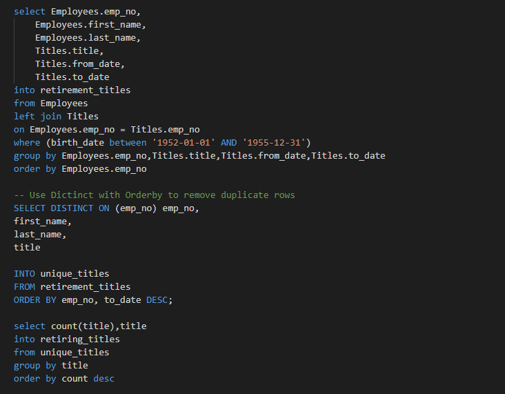

# Pewlett-Hackard-Analysis
# Overview
The purpose of this project was done in order to help a company, Pewlett-Hackard, determine the numer of retiring employees determined by their job title as well as to determine which employees are eligible to participate in a companywide mentorship program. In order to accomplish this multiple tables had to be merged together based upon certain criteria in order to create new, merged databases, that could then be exported to csv files.

# Results

We can see in the above image the result of the first database merge, intended to find the number of retiring employees based upon their job title. This csv file was created through the following sql query:

In this image it is apparent that the bulk of the retiring employees consist of senior engineers and senior staff. This makes sense from a logical perspective as senior engineers and senior staff would have logically progressed further in their career, in order to achieve the senior title, and would thus be closer to retirement age. While this makes sense it is potentially a cause for concern for Pewlett-Hackard as if a large bulk of their senior employees leave all at once then it could leave a void in leadership for the company.
